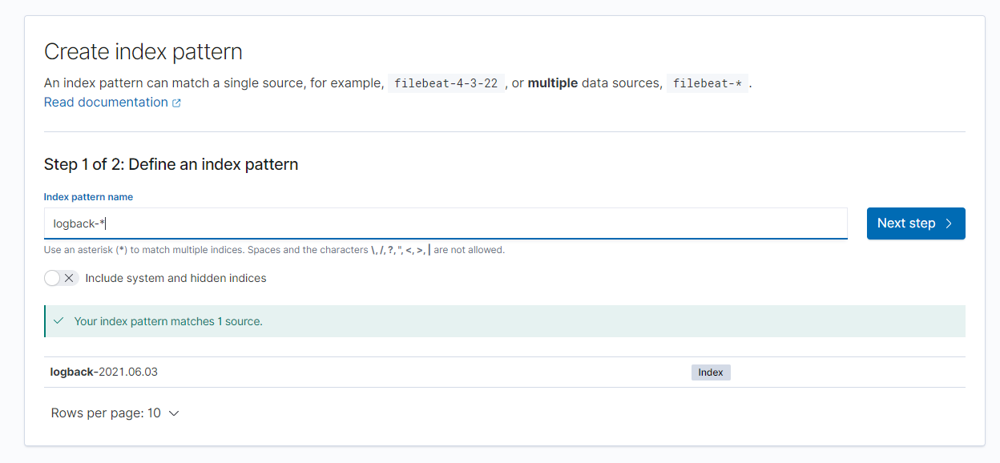
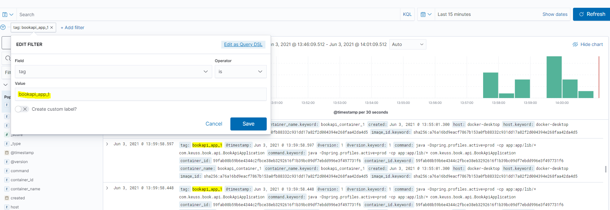
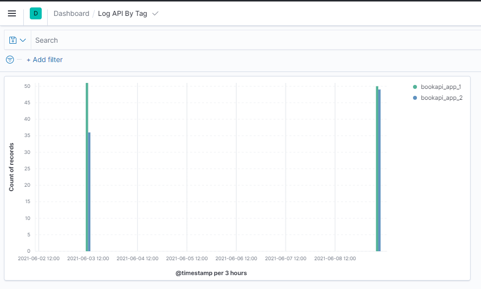

# springboot-log-elastic

POC with SpringBoot (2.5.0) simple API App with [Elastic stack](https://www.elastic.co/fr/) / logstash -> elasticsearch -> kibana (everything in docker)

## Run

 - git clone https://github.com/keuss/springboot-log-elastic
 - `mvn clean package`
 - `docker-compose build` (from docker-elk folder with the docker-compose.yml file)
 - `docker-compose up`
 - To shutdown the stack and remove all persisted data `docker-compose down -v`

## Stack

 - [Logback](http://logback.qos.ch/) with [LogstashEncoder](https://github.com/logstash/logstash-logback-encoder)
 - [Elastic with docker](https://github.com/deviantony/docker-elk) with xpack.license basic
 - Logstash with [GELF](https://docs.docker.com/config/containers/logging/gelf/) log driver (UDP protocol and port 5000 to send messages from Docker services)
 - Index "logback-*" and time filter field name `@timestamp`

 - Filter by tag (bookapi_app_1 or bookapi_app_2)

 - Dashboard example with custom tag

## URLs

 - API Swagger to add data (create some books) : [app1](http://localhost:8080/swagger-ui/index.html) / [app2](http://localhost:8082/swagger-ui/index.html)
 - Kibana : http://localhost:5601/ (elastic/changeme), add sample data first, then create logback-* index

## Links

### Logback

 - https://www.baeldung.com/logback
 - https://github.com/logstash/logstash-logback-encoder
 - https://www.innoq.com/en/blog/structured-logging/ (nice feature like keyValue, ...)
 - https://dev.to/anandsunderraman/json-logging-in-spring-boot-applications-2j33

### Send the Logs of a Java App to the Elastic Stack

 - https://www.baeldung.com/java-application-logs-to-elastic-stack	
 - https://medium.com/@ridwanfajar/send-your-container-logs-to-elk-elasticsearch-logstash-and-kibana-with-gelf-driver-7995714fbbad

### Gelf

 - https://docs.docker.com/config/containers/logging/gelf/
 - https://stackoverflow.com/questions/44050803/unable-to-connect-docker-container-to-logstash-via-gelf-driver
 - https://www.docker.com/blog/adventures-in-gelf/
 - https://blog.zenika.com/2016/02/15/consolider-les-logs-docker-dans-un-elk/

### Docker Port Binding

 - https://docs.docker.com/config/containers/container-networking/
 - https://betterprogramming.pub/how-does-docker-port-binding-work-b089f23ca4c8
 - 0.0.0.0 vs localhost, see [here](https://stackoverflow.com/questions/47025647/localhost-vs-0-0-0-0-with-docker-on-mac-os) and [here](https://stackoverflow.com/questions/59179831/docker-app-server-ip-address-127-0-0-1-difference-of-0-0-0-0-ip), _using [0.0.0.0](https://github.com/keuss/springboot-log-elastic/commit/f83484f16fe9bef88a9b058237f8bb19f7b9a3a9) to listen inside the docker application will work_

